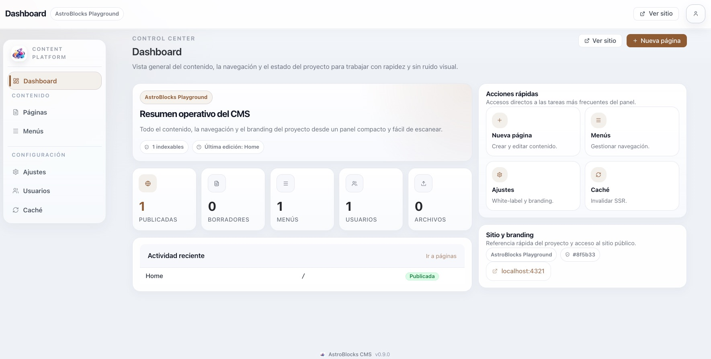
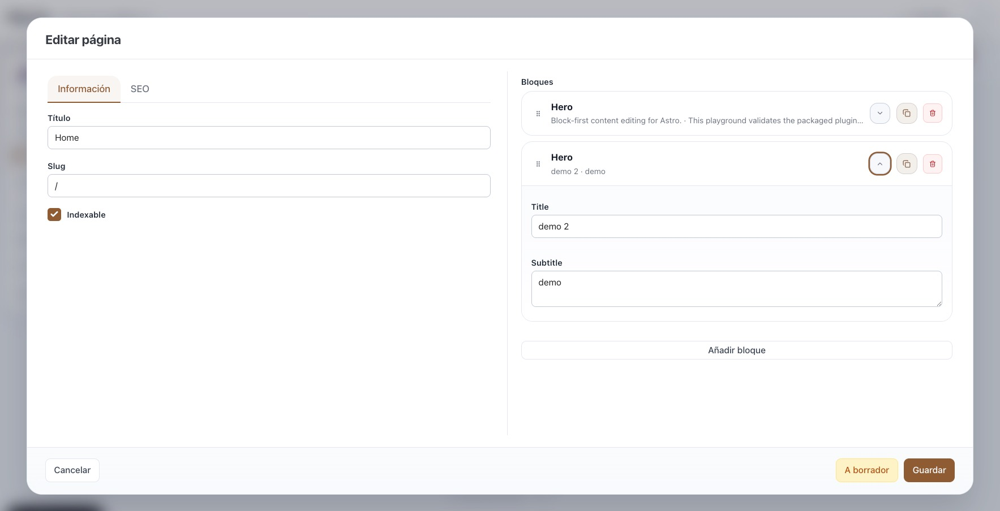

<!--
Copyright (c) 2026 Nauel Gómez Gamero
Licensed under the Business Source License 1.1
-->

<p align="center">
  
</p>

<h1 align="center">AstroBlocks</h1>
<p align="center">
  <strong>Block-first CMS for Astro projects.</strong><br />
  Pages, menus, settings and uploads stored in JSON, with your own Astro components as blocks.
</p>

<p align="center">
  <a href="./CHANGELOG.md"></a>
  
  <a href="https://nodejs.org"></a>
  <a href="https://astro.build"></a>
</p>

---

## Why AstroBlocks

- Edit pages in `/cms` without adding a database.
- Keep full control over the rendered HTML by using your own Astro components.
- Define blocks with a small, explicit schema contract.
- Store content in `data/*.json` and uploads in `public/uploads/`.
- Generate `sitemap-index.xml` and `robots.txt` from the same content source.
- Keep consumer imports explicit and type-safe.

<p align="center">
  
</p>

---

## Block Editor

The page editor is the core of AstroBlocks. It is designed as a compact block builder so content, SEO and structure can be managed from a single workflow.

- **Block-first editing:** pages are built by stacking your own Astro components as CMS blocks.
- **Compact builder UI:** block cards show the most relevant context first and keep advanced editing one step away.
- **SEO and content together:** title, slug, indexability and SEO metadata live in the same editing surface.
- **Ordering without friction:** blocks can be reordered, duplicated and removed directly from the editor.

<p align="center">
  
</p>

---

## Requirements

| Dependency | Version |
| --- | --- |
| Node.js | 18+ |
| Astro | 6+ |
| Adapter | `@astrojs/node` 10+ |

AstroBlocks alpha defaults to **SSR public pages + Astro experimental cache**. Use `output: 'static'` plus a server adapter so `/cms`, `/cms/api`, `/robots.txt`, `/sitemap-index.xml` and CMS-managed public pages can run dynamically.

---

## Install

### From npm

```bash
npm install astro-blocks
npm install @astrojs/node
```

### From a local tarball

Use this when you want to validate a locally built package:

```bash
npm install /absolute/path/to/astro-blocks-0.10.0-alpha.1.tgz
```

The tarball flow is documented in [LOCAL_PACKAGE_TESTING.md](./LOCAL_PACKAGE_TESTING.md).

---

## Recommended Imports

Keep imports split by responsibility:

```ts
import astroBlocks from 'astro-blocks';
import { defineBlockSchema } from 'astro-blocks/contract';
import { getMenu } from 'astro-blocks/getMenu';
```

- `astro-blocks` is the Astro integration entrypoint.
- `astro-blocks/contract` is the public block-schema contract.
- `astro-blocks/getMenu` is the runtime helper for reading menu items inside your site.

---

## Quick Start

### 1. Configure Astro

```ts
import { defineConfig, memoryCache } from 'astro/config';
import node from '@astrojs/node';
import astroBlocks from 'astro-blocks';
import { schema as heroSchema } from './src/components/Hero.schema.ts';

export default defineConfig({
  output: 'static',
  adapter: node({ mode: 'standalone' }),
  experimental: {
    cache: {
      provider: memoryCache(),
    },
  },
  integrations: [
    astroBlocks({
      layoutPath: './src/layouts/Layout.astro',
      blocks: [heroSchema],
    }),
  ],
});
```

### 2. Define a block component

```astro
---
interface Props {
  title: string;
  subtitle?: string;
}

const { title, subtitle } = Astro.props;
---

<section>
  <h1>{title}</h1>
  {subtitle && <p>{subtitle}</p>}
</section>
```

### 3. Define its schema

```ts
import { defineBlockSchema } from 'astro-blocks/contract';

export const schema = defineBlockSchema(
  {
    name: 'Hero',
    icon: 'Layout',
    items: {
      title: { type: 'string', label: 'Title', required: true },
      subtitle: { type: 'text', label: 'Subtitle' },
    },
  },
  new URL('./Hero.astro', import.meta.url).href
);
```

### 4. Provide a layout for CMS-rendered pages

Your layout receives these props:

| Prop | Meaning |
| --- | --- |
| `title` | Final page title |
| `description` | Final meta description |
| `canonical` | Canonical URL |
| `noindex` | Whether the page is non-indexable |
| `site` | Data from `data/site.json` |
| `seo` | Final SEO object, including absolute `image` when present |

Example:

```astro
---
import { getMenu } from 'astro-blocks/getMenu';

const { title, description, canonical, noindex, seo } = Astro.props;
const menu = await getMenu('main');
---

<html lang="en">
  <head>
    <title>{title}</title>
    {description && <meta name="description" content={description} />}
    {canonical && <link rel="canonical" href={canonical} />}
    {noindex && <meta name="robots" content={seo?.nofollow ? 'noindex, nofollow' : 'noindex'} />}
    {seo?.image && <meta property="og:image" content={seo.image} />}
  </head>
  <body>
    <nav>
      {menu.map((item) => <a href={item.path}>{item.name}</a>)}
    </nav>
    <slot />
  </body>
</html>
```

---

## Data Model

AstroBlocks creates and reads these files in the **consumer project root**:

| Path | Purpose |
| --- | --- |
| `data/pages.json` | Pages, slug, status, blocks, `indexable`, SEO |
| `data/site.json` | Site name, base URL, favicon, logo, colors, default SEO |
| `data/menus.json` | Menus and nested menu items |
| `data/users.json` | CMS users |
| `public/uploads/` | Uploaded files |

You can version these files in your project repository if that fits your workflow.

---

## CMS Routes

| Route | Purpose |
| --- | --- |
| `/cms` | Dashboard |
| `/cms/pages` | Pages |
| `/cms/menus` | Menus |
| `/cms/settings` | Site settings |
| `/cms/users` | Users |
| `/cms/cache` | Invalidate AstroBlocks cache |

API routes are available under `/cms/api/*`.

---

## Menus In Your Site

```astro
---
import { getMenu } from 'astro-blocks/getMenu';

const mainMenu = await getMenu('main');
---

<nav>
  {mainMenu.map((item) => (
    <a href={item.path}>{item.name}</a>
  ))}
</nav>
```

Returned menu items have this shape:

```ts
type MenuItem = {
  name: string;
  path: string;
  children?: MenuItem[];
};
```

---

## Plugin Options

| Option | Description |
| --- | --- |
| `layoutPath` | Path to the Astro layout used when AstroBlocks renders a page |
| `blocks` | Array of block schemas imported from your `.schema.ts` files |
| `publicRendering` | `'server'` by default in alpha. Use `'static'` to opt back into prerendered public pages |
| `cache` | Cache behavior for SSR public pages. Enabled by default in alpha when the consumer configures an Astro cache provider |

### Cache Provider

AstroBlocks does **not** configure Astro's cache provider for you. The consumer project must opt into Astro's experimental cache explicitly:

```ts
import { defineConfig, memoryCache } from 'astro/config';

export default defineConfig({
  experimental: {
    cache: {
      provider: memoryCache(),
    },
  },
});
```

Without a provider, AstroBlocks will keep serving pages in SSR mode, but caching and invalidation will be inactive.

### Static Opt-Out

If you want the public site to stay prerendered:

```ts
astroBlocks({
  layoutPath: './src/layouts/Layout.astro',
  blocks: [heroSchema],
  publicRendering: 'static',
});
```

---

## Consumer Troubleshooting

### Content changes do not appear on the public site

CMS-managed public pages are served in SSR by default in alpha. If changes do not appear:

- make sure the page is `published`
- make sure your project is using the AstroBlocks catch-all route and not a conflicting file in `src/pages/`
- make sure your server adapter is configured correctly
- make sure Astro experimental cache is configured if you expect cache invalidation to work

In development, Astro exposes the cache API but does not cache real responses. Validate cache behavior in a built project or preview-like environment.

`Regenerate site` runs a fresh build artifact, but it is not required to see content changes during development.

### The CMS routes do not work

Check all of these:

- you are using Astro 6+
- you have a server adapter configured
- `output: 'static'` is enabled
- the integration is included in `astro.config.*`

### My home page is not coming from the CMS

If your project already has `src/pages/index.astro`, Astro may serve that file instead of the CMS home page.

### The layout receives a relative SEO image

AstroBlocks already converts relative `seo.image` values to absolute URLs before passing them to your layout. Use `seo.image` directly for `og:image` and `twitter:image`.

### I want to validate a local build before publishing

Use the tarball flow documented in [LOCAL_PACKAGE_TESTING.md](./LOCAL_PACKAGE_TESTING.md).

---

## For Maintainers

This README is intentionally consumer-focused.

If you are working on AstroBlocks itself, use:

- [DEVELOPING.md](./DEVELOPING.md) for build, workspace, playground and release workflow
- [AGENTS.md](./AGENTS.md) for repository-specific implementation rules
