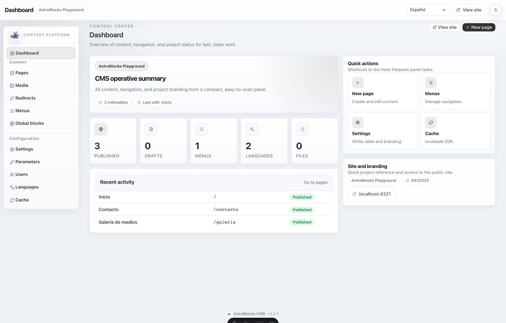
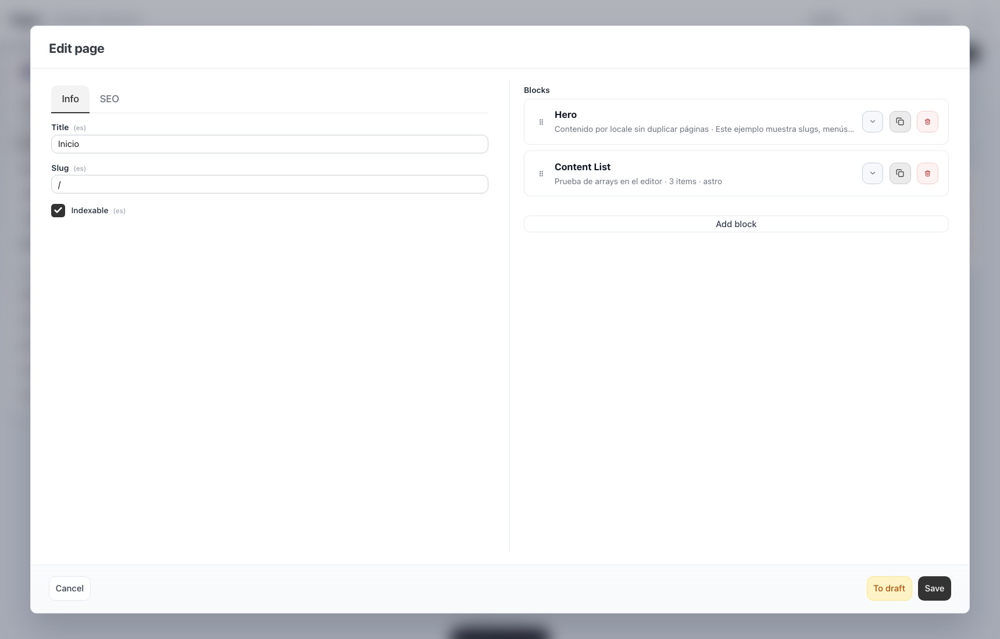
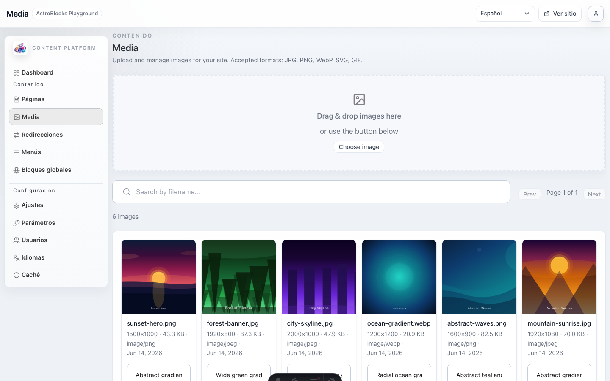
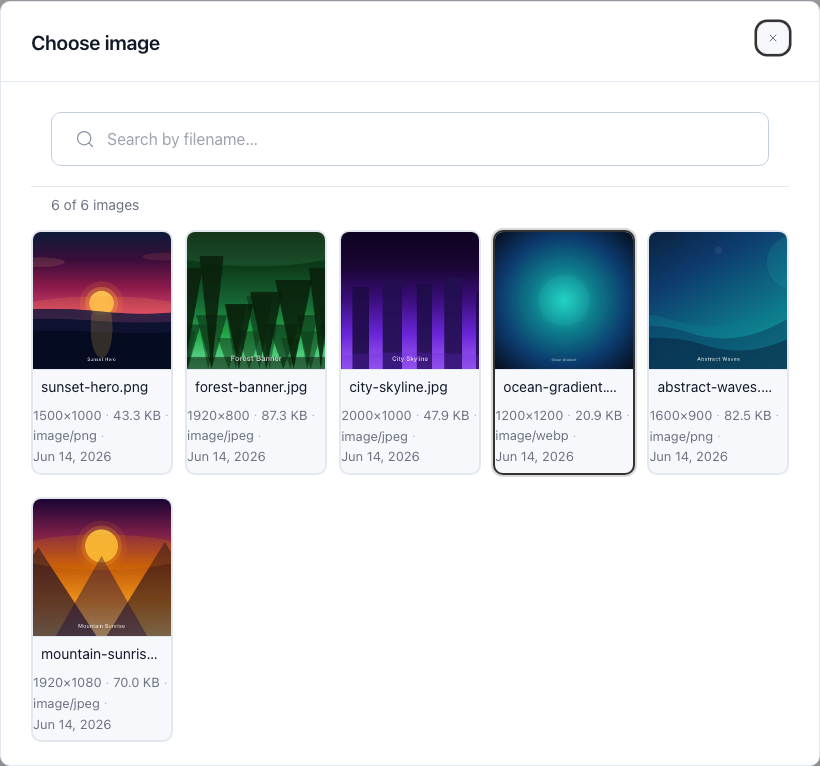
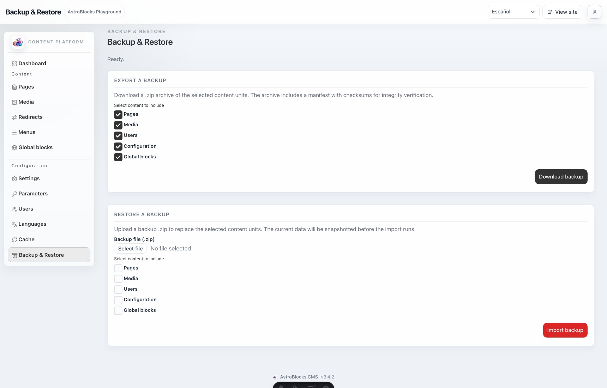

<!--
Copyright (c) 2026 Nauel Gómez Gamero
Licensed under the Business Source License 1.1
-->

<p align="center">
  
</p>

<h1 align="center">AstroBlocks</h1>
<p align="center">
  <strong>Block-first CMS for Astro projects.</strong><br />
  Pages, menus, params, settings and a responsive media library stored in JSON, with your own Astro components as blocks.
</p>

<p align="center">
  <a href="./CHANGELOG.md"></a>
  
  <a href="https://www.npmjs.com/package/@astroblocks/astro-blocks"></a>
  <a href="https://www.npmjs.com/package/@astroblocks/astro-blocks"></a>
  
  <a href="https://nodejs.org"></a>
  <a href="https://astro.build"></a>
</p>

---

## Overview

Block-based content CMS integration for Astro with admin panel, page builder, menus, SEO and cache invalidation.

AstroBlocks is an Astro integration that adds a block-first content CMS to your project — without a database. Content editors build pages in a `/cms` admin panel by composing **your own Astro components** as reusable blocks; the content is stored as JSON in `data/*.json` and uploads land in `public/uploads/`. You keep full control of the rendered HTML because the blocks are your components.

The integration runs in **SSR mode by default**: it needs an Astro SSR adapter so the `/cms` admin, its API, `/robots.txt`, `/sitemap-index.xml` and CMS-managed public pages can run dynamically. Automatic responsive image generation (WebP/AVIF variants) runs in-process after upload, so `@astrojs/node` standalone is the supported target for that pipeline. Public pages can be opted back into static prerendering with `publicRendering: 'static'`.

- Edit pages in `/cms` without adding a database.
- Keep full control over the rendered HTML by using your own Astro components.
- Define blocks with a small, explicit, type-safe schema contract.
- Manage media in a built-in library with responsive images, alt text and captions out of the box.
- Store content in `data/*.json` and uploads in `public/uploads/`.
- Generate `sitemap-index.xml` and `robots.txt` from the same content source.
- Keep consumer imports explicit and type-safe.

## Table of Contents

- [Overview](#overview)
- [Features](#features)
- [Showcase](#showcase)
- [Requirements & Compatibility](#requirements--compatibility)
- [Installation](#installation)
- [Environment Setup](#environment-setup)
- [Quick Start](#quick-start)
- [Public API (Imports)](#public-api-imports)
- [Configuration Reference](#configuration-reference)
- [Features in Depth](#features-in-depth)
- [Data Model & CMS Routes](#data-model--cms-routes)
- [Deployment](#deployment)
- [Using with AI Tools](#using-with-ai-tools)
- [Troubleshooting / FAQ](#troubleshooting--faq)
- [Versioning & Support](#versioning--support)
- [Security](#security)
- [Contributing](#contributing)
- [License](#license)

## Features

A snapshot of what AstroBlocks provides, grouped by area. Full behavior for each area lives in [Features in Depth](#features-in-depth) and the linked reference docs.

| Area | Highlights |
| --- | --- |
| **Admin** | Compact CMS dashboard with project status, quick actions and recent activity; site import/export (backup and restore selected content units). |
| **Editor** | Page block editor that composes your own Astro components; typed block schema contract; schema-driven, locale-aware global blocks. |
| **Publishing** | Draft / published / archived page workflow; server or static public rendering. |
| **SEO** | Per-page title, description, canonical, image and indexability; `robots.txt` and `sitemap-index.xml` generated from CMS content. |
| **Navigation** | Visual nested menus builder with selector-based access; 301/302 redirect rules manager (SSR mode). |
| **Runtime** | `getConfig` key/value parameters; `getMenu`, `getLanguages`, `getI18nMeta` locale-aware helpers. |
| **Media** | Media library with search and metadata; automatic responsive WebP/AVIF variants via `<BlockImage>`; per-asset and per-usage alt text; captions; where-used and in-place replace; non-image file uploads (PDF/document support). |
| **Auth** | Session-based (JWT) CMS authentication with owner and user roles. |
| **i18n** | Content languages and default locale; admin UI in English or Spanish. |
| **Performance** | Astro experimental cache invalidation from content updates and manual panel actions. |

> **Maturity note.** The feature set is pre-1.0 and tracked as **alpha** in the [features manifest](./meta/features.json) (cache invalidation is marked experimental). The API surface can still change between minor versions. The version badge above reflects the current published npm release channel; see [Versioning & Support](#versioning--support).

## Showcase

<p align="center">
  
  <br /><em>The CMS dashboard — project status, quick actions and recent activity.</em>
</p>

<p align="center">
  
  <br /><em>The page editor — a compact block builder where content, SEO and structure are managed together.</em>
</p>

<p align="center">
  
  <br /><em>The media library — upload, search, paginate, edit alt text and see per-asset metadata.</em>
</p>

<p align="center">
  
  <br /><em>The image field picker — choose an asset and set a per-usage alt and caption.</em>
</p>

<p align="center">
  
  <br /><em>The import / export page — select units, download a backup, or restore from a .zip file.</em>
</p>

## Requirements & Compatibility

| Dependency | Version | Notes |
| --- | --- | --- |
| Node.js | 18+ | ESM and native async APIs |
| Astro | 6+ | Registered via `astro:config:setup` (peer dependency `astro ^6.0.0`) |
| SSR adapter | any | Required for the `/cms` admin, its API, and SSR public pages |
| `@astrojs/node` | 10+ (standalone) | Supported target for **responsive image variant generation** |

AstroBlocks runs in **SSR mode by default** (`publicRendering: 'server'`). The `/cms` admin, `/cms/api`, `/robots.txt`, `/sitemap-index.xml` and CMS-managed public pages all require a server adapter. You may set `publicRendering: 'static'` to prerender the public pages, but the **admin routes still require SSR**. See [Deployment](#deployment) for adapter and serverless caveats.

## Installation

Install the integration and an SSR adapter (`@astrojs/node` is the reference adapter):

```bash
# npm
npm install @astroblocks/astro-blocks @astrojs/node
```

```bash
# pnpm
pnpm add @astroblocks/astro-blocks @astrojs/node
```

```bash
# yarn
yarn add @astroblocks/astro-blocks @astrojs/node
```

> To validate a locally built package before publishing, use the tarball flow documented in [LOCAL_PACKAGE_TESTING.md](./LOCAL_PACKAGE_TESTING.md).

## Environment Setup

The admin UI at `/cms` uses stateless JWT sessions. The admin account is created on **first login** — there are no admin username/password variables to configure.

| Variable | Required | Description |
| --- | --- | --- |
| `ASTRO_BLOCKS_JWT_SECRET` | Yes (production) | Secret used to sign and verify JWT session tokens. Use a long random string (32+ characters). Rotating it invalidates all sessions. **Required in production** — without it the admin login returns `503` and no session is issued. Legacy alias `CMS_JWT_SECRET` is accepted but deprecated. |

Example `.env` (local development only — **never commit real values**):

```sh
ASTRO_BLOCKS_JWT_SECRET=your-long-random-secret-here
```

> Set this as an environment/runtime variable on your deployment platform — not in committed files. The **first person to log in at `/cms` creates the owner account**, so complete that initial login yourself over a trusted connection right after deploying. For the complete list of optional variables (upload and import size limits, project-root override), see the [Environment Variables Reference](./AGENTS.consumer.md#environment-variables-reference-complete-list) in `AGENTS.consumer.md`.

## Quick Start

### 1. Configure Astro

```ts
import { defineConfig, memoryCache } from 'astro/config';
import node from '@astrojs/node';
import astroBlocks from '@astroblocks/astro-blocks';
import { schema as heroSchema } from './src/components/Hero.schema.ts';

export default defineConfig({
  output: 'static',
  adapter: node({ mode: 'standalone' }),
  experimental: {
    cache: {
      provider: memoryCache(),
    },
  },
  integrations: [
    astroBlocks({
      layoutPath: './src/layouts/Layout.astro',
      blocks: [heroSchema],
    }),
  ],
});
```

### 2. Define a block component

```astro
---
interface Props {
  title: string;
  subtitle?: string;
}

const { title, subtitle } = Astro.props;
---

<section>
  <h1>{title}</h1>
  {subtitle && <p>{subtitle}</p>}
</section>
```

### 3. Define its schema

Keep the schema in a **separate `.schema.ts` file** next to the component (see the [FAQ](#faq) for why importing a `.astro` file from `astro.config` can break):

```ts
import { defineBlockSchema } from '@astroblocks/astro-blocks/contract';

export const schema = defineBlockSchema(
  {
    name: 'Hero',
    icon: 'Layout',
    items: {
      title: { type: 'string', label: 'Title', required: true },
      subtitle: { type: 'text', label: 'Subtitle' },
    },
  },
  new URL('./Hero.astro', import.meta.url).href
);
```

Array fields are also supported for repeatable content:

```ts
items: {
  tags: {
    type: 'array',
    label: 'Tags',
    minItems: 1,
    maxItems: 6,
    item: { type: 'string', label: 'Tag' },
  },
  faqs: {
    type: 'array',
    label: 'FAQs',
    item: {
      type: 'object',
      label: 'FAQ',
      summaryField: 'question',
      fields: {
        question: { type: 'string', label: 'Question', required: true },
        answer: { type: 'text', label: 'Answer', required: true },
      },
    },
  },
}
```

### 4. Provide a layout for CMS-rendered pages

Your layout receives these props:

| Prop | Meaning |
| --- | --- |
| `title` | Final page title |
| `description` | Final meta description |
| `canonical` | Canonical URL |
| `noindex` | Whether the page is non-indexable |
| `site` | Data from `data/site.json` |
| `seo` | Final SEO object, including absolute `image` when present |
| `i18n` | i18n context for the current page (`locale`, `defaultLocale`, `alternates`) |

Example:

```astro
---
import { getMenu } from '@astroblocks/astro-blocks/getMenu';
import { getI18nMeta } from '@astroblocks/astro-blocks/getI18nMeta';

const { title, description, canonical, noindex, seo, site, i18n } = Astro.props;
const menu = await getMenu('main');
const i18nMeta = getI18nMeta(i18n, { baseUrl: site?.baseUrl });
---

<html lang={i18nMeta?.htmlLang || 'en'}>
  <head>
    <title>{title}</title>
    {description && <meta name="description" content={description} />}
    {canonical && <link rel="canonical" href={canonical} />}
    {noindex && <meta name="robots" content={seo?.nofollow ? 'noindex, nofollow' : 'noindex'} />}
    {seo?.image && <meta property="og:image" content={seo.image} />}
    {i18nMeta?.alternates.map((entry) => (
      <link rel="alternate" hreflang={entry.hrefLang} href={entry.href} />
    ))}
    {i18nMeta?.ogLocale && <meta property="og:locale" content={i18nMeta.ogLocale} />}
    {i18nMeta?.ogLocaleAlternate.map((entry) => (
      <meta property="og:locale:alternate" content={entry} />
    ))}
  </head>
  <body>
    <nav>
      {menu.map((item) => <a href={item.path}>{item.name}</a>)}
    </nav>
    <slot />
  </body>
</html>
```

### 5. Run

Set the [required environment variables](#environment-setup), start your dev server (or build and preview), then open `/cms` and log in.

> **Add `.astro-blocks/` to your `.gitignore`.** The plugin generates this directory on every build to re-export your layout and block components. It must not be edited or committed. Your CMS content (`data/*.json`, `public/uploads/`) is separate and *should* be committed.

> In SSR mode (`publicRendering: 'server'`), AstroBlocks can use `Accept-Language` on `/` to redirect to a non-default enabled locale when available. Locale preference is then persisted with a cookie so users can switch language and keep their chosen locale.

## Public API (Imports)

All public exports are explicit and type-safe. The table matches the package `exports` map exactly:

| Import path | Purpose |
| --- | --- |
| `@astroblocks/astro-blocks` | Default export — the Astro integration entrypoint (use in `astro.config.*`). |
| `@astroblocks/astro-blocks/contract` | Public block-schema contract (`defineBlockSchema`, `PROP_TYPES`, and types). |
| `@astroblocks/astro-blocks/getMenu` | Runtime helper for reading menu items inside your site. |
| `@astroblocks/astro-blocks/getConfig` | Reads CMS parameters from `data/configs.json` at runtime (`getConfig`, `getConfigMap`). |
| `@astroblocks/astro-blocks/getLanguages` | Reads configured content languages for locale switchers. |
| `@astroblocks/astro-blocks/getI18nMeta` | Builds `hreflang`, `html lang` and OpenGraph locale metadata from AstroBlocks i18n context. |
| `@astroblocks/astro-blocks/components/GlobalBlock` | Renders a declared global block by slug. |
| `@astroblocks/astro-blocks/components/BlockImage` | Renders images with automatic `<picture>`/srcset when variants are ready. |
| `@astroblocks/astro-blocks/getMediaVariants` | Reads responsive image variant data from `data/media.json` with mtime caching. |
| `@astroblocks/astro-blocks/getFileValue` | Helpers for `file`-type block prop values (`fileDownloadUrl`, `toFileValue`, etc.). |

```ts
import astroBlocks from '@astroblocks/astro-blocks';
import { defineBlockSchema } from '@astroblocks/astro-blocks/contract';
import { getConfig } from '@astroblocks/astro-blocks/getConfig';
import { getI18nMeta } from '@astroblocks/astro-blocks/getI18nMeta';
import { getLanguages } from '@astroblocks/astro-blocks/getLanguages';
import { getMediaVariants } from '@astroblocks/astro-blocks/getMediaVariants';
import { getMenu } from '@astroblocks/astro-blocks/getMenu';
import { fileDownloadUrl } from '@astroblocks/astro-blocks/getFileValue';
import BlockImage from '@astroblocks/astro-blocks/components/BlockImage';
import GlobalBlock from '@astroblocks/astro-blocks/components/GlobalBlock';
```

## Configuration Reference

All options are passed to `astroBlocks({})` in `astro.config.*` (the `AstroBlocksOptions` type):

| Option | Type | Default | Description |
| --- | --- | --- | --- |
| `blocks` | `BlockSchema[]` | — (required) | Array of block schemas imported from your `.schema.ts` files. Registers which components are available in the page builder. Resolved at config time — you cannot add blocks at runtime. |
| `layoutPath` | `string` | `'./src/layouts/Layout.astro'` | Path to the Astro layout wrapped around all CMS-managed public pages. |
| `globalBlocks` | `GlobalBlockDeclaration[]` | `undefined` | Declarations for reusable singleton blocks. Each entry is `{ slug, schema, label? }`. See [Global Blocks](#global-blocks). |
| `publicRendering` | `'server' \| 'static'` | `'server'` | Whether CMS-managed public pages are served via SSR or prerendered as static HTML. |
| `cache` | `{ enabled?: boolean; maxAge?: number; swr?: number }` | see below | HTTP cache behavior for SSR public pages. No effect in static mode. |
| `i18n` | `{ routingStrategy?: 'path-prefix' }` | `{ routingStrategy: 'path-prefix' }` | Public routing contract for localized paths. Only `'path-prefix'` is supported in this version. |
| `allowedFileTypes` | `string[]` | see [File Uploads](#file-uploads--non-image) | Global allowlist of MIME types accepted by the media upload endpoint. Lowercased and deduplicated automatically. |

The `cache` sub-shape:

| Field | Type | Default | Description |
| --- | --- | --- | --- |
| `enabled` | `boolean` | `true` | Enable caching for SSR public pages (active only when the consumer configures an Astro cache provider). |
| `maxAge` | `number` | `60` | `max-age` in seconds. |
| `swr` | `number` | `300` | `stale-while-revalidate` in seconds. |

### Cache Provider

AstroBlocks does **not** configure Astro's cache provider for you. The consumer project must opt into Astro's experimental cache explicitly:

```ts
import { defineConfig, memoryCache } from 'astro/config';

export default defineConfig({
  experimental: {
    cache: {
      provider: memoryCache(),
    },
  },
});
```

Without a provider, AstroBlocks keeps serving pages in SSR mode, but caching and invalidation are inactive.

### Static Opt-Out

To keep the public site prerendered:

```ts
astroBlocks({
  layoutPath: './src/layouts/Layout.astro',
  blocks: [heroSchema],
  publicRendering: 'static',
});
```

> When `publicRendering: 'static'`, redirect rules configured in `/cms/redirects` are not applied, and `cache` options have no effect.

## Features in Depth

### Blocks & Schemas

A block is one of **your** Astro components plus a schema that declares its editable fields. The CMS page builder renders the editing UI from that schema; the plugin resolves the component path from the URL you pass to `defineBlockSchema(..., import.meta.url)`.

Field types available in `items`: `string`, `text`, `number`, `boolean`, `image`, `link`, `select` (requires `options: string[]`), `file`, and `array` (requires an `item` definition; supports `sortable`, `minItems`, `maxItems`). Add `localizable: true` to any primitive field for per-language editing.

> **Gotcha — keep schemas in a separate file.** Importing a `.astro` file directly from `astro.config` can fail with a parse error because the config is evaluated before `.astro` files are processed as components. Define the schema in a `.schema.ts`/`.schema.mjs` file next to the component and pass the component path with `new URL('./Name.astro', import.meta.url).href`. See the [FAQ entry](#faq).

### Global Blocks

Global blocks are reusable **singleton** content sections (headers, footers, banners) edited once and rendered anywhere. Each declared slug is bound to a `BlockSchema` at declaration time and stores exactly one set of props.

Declare them via the `globalBlocks` option:

```js
astroBlocks({
  blocks: [heroSchema],
  globalBlocks: [
    { slug: 'site-header', schema: globalHeaderSchema, label: 'Header' },
    { slug: 'site-footer', schema: globalFooterSchema },
  ],
});
```

Render one anywhere in your project:

```astro
---
import GlobalBlock from '@astroblocks/astro-blocks/components/GlobalBlock';
---

<GlobalBlock slug="site-header" />
<main><!-- page content --></main>
<GlobalBlock slug="site-footer" />
```

Slugs are static (`^[a-z0-9][a-z0-9-]*$`, unique), managed in the admin at `/cms/global-blocks`, and stored in `data/global-blocks.json`. Full declaration rules, the REST API, storage shape, i18n behavior and the v1→v2 migration note are in [AGENTS.consumer.md → Global Blocks](./AGENTS.consumer.md#global-blocks).

### Media & Responsive Images

Upload an image once at `/cms/media`; AstroBlocks captures its dimensions, generates WebP and AVIF variants in the background (only for breakpoints strictly smaller than the original — no upscaling), and serves the best format the browser supports. The original is always retained as the `` fallback, even while processing or on failure.

Render image fields with `<BlockImage>` — it emits a `<picture>` with avif + webp sources when variants are ready and a plain `` otherwise, with `alt` always present (WCAG 1.1.1):

```astro
---
import BlockImage from '@astroblocks/astro-blocks/components/BlockImage';
---

<BlockImage image={block.props.image} />
<BlockImage image={block.props.heroImage} priority={true} />
<BlockImage image={block.props.galleryImage} sizes="(max-width: 640px) 100vw, 50vw" />
```

For advanced cases, read variant data directly with `getMediaVariants('/uploads/…')`. Full guide — editor workflow, the `ImageFieldValue`/`MediaEntry` shapes, `<BlockImage>` props, the API endpoints and limitations — in [docs/media.md](./docs/media.md).

### File Uploads / Non-Image

AstroBlocks accepts non-image uploads (PDF and documents) alongside images. Use the `file` block prop type for file references:

```ts
items: {
  file: {
    type: 'file',
    label: 'PDF Document',
    accept: ['application/pdf'],   // optional per-component MIME filter
    download: true,                // optional: default download behaviour
  },
}
```

Render the value with the `fileDownloadUrl` helper — when `download === true` it appends `?download` so the server sets `Content-Disposition: attachment`:

```astro
---
import { fileDownloadUrl } from '@astroblocks/astro-blocks/getFileValue';
import type { FileFieldValue } from '@astroblocks/astro-blocks/contract';

const { file } = Astro.props as { file?: FileFieldValue };
const href = file?.url ? fileDownloadUrl(file) : undefined;
---

{href && <a href={href} download={file?.download ? file.filename : undefined}>Download PDF</a>}
```

The global allowlist is controlled by the `allowedFileTypes` option (default: `image/jpeg`, `image/png`, `image/webp`, `image/svg+xml`, `image/gif`, `application/pdf`). A hard security denylist (HTML, JavaScript, executables, shell scripts) is **always enforced** and cannot be re-enabled. Full details — the `FileFieldValue` shape, PDF serving behavior, the denylist and document tiles — are in [docs/media.md → Non-image file uploads](./docs/media.md#non-image-file-uploads-pdf-and-document-support).

### Menus

Read menu items in your templates with `getMenu`:

```astro
---
import { getMenu } from '@astroblocks/astro-blocks/getMenu';

const mainMenu = await getMenu('main', { locale: 'es' });
---

<nav>
  {mainMenu.map((item) => <a href={item.path}>{item.name}</a>)}
</nav>
```

Items have the shape `{ name: string; path: string; children?: MenuItem[] }`. Unknown selectors return an empty array (never throws).

### Languages

Read configured content languages for locale switchers:

```astro
---
import { getLanguages } from '@astroblocks/astro-blocks/getLanguages';

const { languages, defaultLocale } = await getLanguages();
---

<nav>
  {languages.map((language) => (
    <a href={language.code === defaultLocale ? '/' : `/${language.code}`}>{language.label}</a>
  ))}
</nav>
```

### Config Parameters

Manage global key/value parameters in `/cms/configs` and consume them at runtime:

```astro
---
import { getConfig, getConfigMap } from '@astroblocks/astro-blocks/getConfig';

const mapsKey = await getConfig('GOOGLE_MAPS_API_KEY');
const allConfigs = await getConfigMap();
---
```

- `getConfig(key)` matches keys case-insensitively and returns `string | undefined`.
- `getConfigMap()` returns every configured key/value pair as an object.
- In SSR mode, updates from `/cms/configs` are available after save + cache invalidation. In `publicRendering: 'static'`, values are fixed at build time until the next rebuild.

### Import / Export

The Import / Export admin page (`/cms/import-export`, owner only) backs up and restores site content without touching the file system directly. Choose any combination of five data units for each operation:

| Unit | Contents |
| --- | --- |
| Users | `data/users.json` |
| Pages | `data/pages.json` |
| Media | `data/media.json` + `public/uploads/` files |
| Global Blocks | `data/global-blocks.json` |
| Configuration | `data/configs.json`, `data/site.json`, `data/languages.json`, `data/menus.json`, `data/redirects.json` |

Export streams a single `.zip` (selected data files + a `manifest.json` recording the schema version, timestamp and per-file SHA-256 checksums). Import validates structure and checksums before applying, then replaces selected units **in full** — a pre-replace snapshot is written to `data/_backups/` automatically (retention: 5). When an instance has no users yet, the login screen offers a bootstrap import to seed an initial data set with no admin account required. The underlying REST endpoints (`GET /cms/api/export`, `POST /cms/api/import`, `POST /cms/api/import/bootstrap`) and their auth rules are documented in [AGENTS.consumer.md → Import / Export](./AGENTS.consumer.md#import--export-backup-and-restore).

Three environment variables control import size limits (defaults: `ASTRO_BLOCKS_MAX_IMPORT_FILE_BYTES` = 50 MB, `ASTRO_BLOCKS_MAX_IMPORT_TOTAL_BYTES` = 500 MB, `ASTRO_BLOCKS_MAX_IMPORT_COMPRESSED_BYTES` = 1 GB).

### SEO, Sitemap & robots.txt

Each page carries its own SEO controls — title, description, canonical, `image`, and indexability — surfaced to your layout via the `seo` prop (relative `seo.image` values are converted to absolute URLs before they reach your layout). The plugin auto-injects `/robots.txt` and `/sitemap-index.xml`, generated from your published CMS content. These injected routes cannot be overridden — do not create `src/pages/robots.txt.ts` or a sitemap route, or they will conflict.

### i18n Routing

i18n uses path prefixes (`path-prefix`, the only strategy in this version). For a site with `en` (default) and `es`: an English page at slug `about` is served at `/about` (default locale has no prefix); the Spanish page is served at `/es/about`. The CMS passes `locale` and `alternates` to your layout; use `getI18nMeta` to build `hreflang`, `html lang` and OpenGraph locale metadata. See [AGENTS.consumer.md → i18n Routing](./AGENTS.consumer.md#i18n-routing).

### Caching

SSR public pages can be cached through Astro's experimental cache provider (which you configure — see [Cache Provider](#cache-provider)). Content updates and manual actions in `/cms/cache` invalidate the cache. In development, Astro exposes the cache API but does not cache real responses — validate cache behavior in a built or preview-like environment.

## Data Model & CMS Routes

### Data Model

AstroBlocks creates and reads these files in the **consumer project root**. Commit them — they are your CMS content source of truth. Do **not** commit the generated `.astro-blocks/` directory.

| Path | Purpose |
| --- | --- |
| `data/pages.json` | Pages, slug, status, blocks, `indexable`, SEO |
| `data/site.json` | Site name, base URL, favicon, logo, colors, default SEO |
| `data/menus.json` | Menus and nested menu items |
| `data/redirects.json` | Manual redirect rules (`from`, `to`, `301/302`, `enabled`) |
| `data/configs.json` | Global key/value parameters (`key`, `value`, `description`) |
| `data/languages.json` | Content languages (`code`, `label`, `enabled`, `isDefault`) |
| `data/users.json` | CMS users (hashed passwords) |
| `data/global-blocks.json` | Global block props per declared slug (`{ globalBlocks: { [slug]: { props, updatedAt? } } }`) |
| `data/media.json` | Media registry: uploaded files, dimensions, alt text, variants and status |
| `public/uploads/` | Uploaded files and responsive image variants (`YYYY/MM` subdirectories) |

### CMS Routes

Injected by the plugin via `injectRoute` — do **not** re-create them in `src/pages/` or they will conflict.

| Route | Purpose |
| --- | --- |
| `/cms` | Dashboard |
| `/cms/pages` | Pages |
| `/cms/media` | Media library (upload, browse, pick, replace, delete) |
| `/cms/redirects` | Redirect rules (SSR mode only) |
| `/cms/configs` | Global parameters |
| `/cms/menus` | Menus |
| `/cms/settings` | Site settings |
| `/cms/global-blocks` | Global block management (single form per declared slug) |
| `/cms/users` | Users |
| `/cms/languages` | Content languages |
| `/cms/cache` | Invalidate AstroBlocks cache |
| `/cms/import-export` | Export a backup `.zip` or import one to restore content (owner only) |
| `/cms/api/[...path]` | Internal API used by the admin UI — do not call directly |

## Deployment

AstroBlocks needs an **SSR adapter** for the admin, its API, `/robots.txt`, `/sitemap-index.xml` and SSR public pages. `@astrojs/node` (standalone) is the reference adapter and the **supported target for responsive image variant generation**, because variant generation runs in-process after the upload response returns.

> **Serverless / edge caveat.** On serverless or edge targets the process may freeze before background variant generation completes, leaving entries in `status: 'processing'`. The original upload is always served regardless, so pages are never broken — but for reliable variant generation deploy on `@astrojs/node` standalone (or a long-lived Node process). The admin and public SSR pages themselves work on any Astro SSR adapter.

Set the [required environment variables](#environment-setup) as runtime variables on your platform, and persist `public/uploads/` and `data/*.json` (commit them, or configure your pipeline to persist them outside git).

## Using with AI Tools

`@astroblocks/astro-blocks` ships a consumer-facing AI context file, [AGENTS.consumer.md](./AGENTS.consumer.md), inside the npm tarball. AI coding assistants (Claude, Copilot, Cursor, Windsurf, etc.) can read it to understand the integration API, block patterns, admin routes and environment variables without manual explanation. It lands at:

```
node_modules/@astroblocks/astro-blocks/AGENTS.consumer.md
```

One-line setup — detects your project's `AGENTS.md` or `CLAUDE.md` (creating `AGENTS.md` if neither exists) and appends a reference to the installed context file:

```sh
npx astro-blocks init-ai
```

The context file is auto-versioned with the installed package — re-run the command after upgrading. Use `--copy` to embed the full content inline instead of a reference link:

```sh
npx astro-blocks init-ai --copy
```

## Troubleshooting / FAQ

<a id="faq"></a>

### Importing a `.astro` schema from `astro.config` fails with a parse error

If `import { schema } from './src/components/Hero.astro'` in your config throws an "invalid JS syntax" / parse error, it is because the config is evaluated **before** `.astro` files are processed as components. Define the schema in a **separate JS/TS file** next to the component and pass the component path with `new URL('./Name.astro', import.meta.url).href`:

```ts
// src/components/Hero.schema.ts
import { defineBlockSchema } from '@astroblocks/astro-blocks/contract';

export const schema = defineBlockSchema(
  {
    name: 'Hero',
    icon: 'Layout',
    key: 'hero',
    items: {
      title: { type: 'string', label: 'Title', required: true },
      subtitle: { type: 'text', label: 'Subtitle' },
    },
  },
  new URL('./Hero.astro', import.meta.url).href
);
```

```ts
// astro.config.ts
import { schema as heroSchema } from './src/components/Hero.schema';

astroBlocks({ layoutPath: './src/layouts/Layout.astro', blocks: [heroSchema] });
```

The `.astro` component then stays a pure component (it does not export a schema). The plugin uses the URL stored in the schema to generate the runtime and import the component; the `.schema.ts` file only exists so the config can import the schema without touching `.astro`.

### The admin login does not work

The admin login requires `ASTRO_BLOCKS_JWT_SECRET` from [Environment Setup](#environment-setup) to be set in the server environment. In production, a missing secret makes the login endpoint return `503` (no session is issued) — confirm it is set at runtime (in your deployment platform, not only in a local `.env`) and not committed to git. The admin account is created on first login; there are no admin username/password variables.

### Content changes do not appear on the public site

CMS-managed public pages are served in SSR by default. If changes do not appear:

- make sure the page is `published`;
- make sure your project uses the AstroBlocks catch-all route and not a conflicting file in `src/pages/`;
- make sure your server adapter is configured correctly;
- make sure Astro experimental cache is configured if you expect cache invalidation to work.

In development, Astro exposes the cache API but does not cache real responses — validate cache behavior in a built or preview-like environment.

### The CMS routes do not work

Check all of these: you are using Astro 6+, you have a server adapter configured, `output: 'static'` is enabled with that adapter, and the integration is included in `astro.config.*`.

### My home page is not coming from the CMS

If your project already has `src/pages/index.astro`, Astro may serve that file instead of the CMS home page. Remove or rename it.

### The layout receives a relative SEO image

AstroBlocks already converts relative `seo.image` values to absolute URLs before passing them to your layout. Use `seo.image` directly for `og:image` and `twitter:image`.

### I want to validate a local build before publishing

Use the tarball flow documented in [LOCAL_PACKAGE_TESTING.md](./LOCAL_PACKAGE_TESTING.md).

## Versioning & Support

Only the **latest published npm release** and the **`main` branch** are maintained. There are no backported security or feature branches for older releases. Release history is in [CHANGELOG.md](./CHANGELOG.md).

## Security

Report vulnerabilities privately — see [SECURITY.md](./SECURITY.md) for the full policy and reporting channels (do not open a public issue for security problems).

When deploying a site that uses this integration:

- Set a strong, unique `ASTRO_BLOCKS_JWT_SECRET` (32+ characters) and strong admin credentials — never use example values.
- Never commit real `.env` files to version control.
- Keep `npm audit` and dependency updates in your workflow.

## Contributing

Contributions are welcome under the terms of the [License](#license). Start with:

- [CONTRIBUTING.md](./CONTRIBUTING.md) — contribution guidelines (primary).
- [DEVELOPING.md](./DEVELOPING.md) — build, workspace, playground and release workflow.
- [AGENTS.md](./AGENTS.md) — repository-specific implementation rules.

## License

AstroBlocks is distributed under the **Business Source License 1.1 (BUSL-1.1)** — it is **source-available, not open-source**, and commercial use is subject to the license terms. See [LICENSE.md](./LICENSE.md) for the full text.

- **Change Date: 2029-01-01.** On that date the Licensed Work converts to the **MIT License**.
- **Additional Use Grant.** You may use AstroBlocks for personal, educational and internal business purposes, and to build websites or projects for clients — provided AstroBlocks itself is not offered as a product or service.
- **Restrictions.** You may **not** offer AstroBlocks as a hosted/SaaS product, provide managed hosting primarily based on it, resell or sublicense it, or build a competing commercial CMS or website builder based on it.

For commercial licensing or SaaS usage rights, contact the Licensor.
